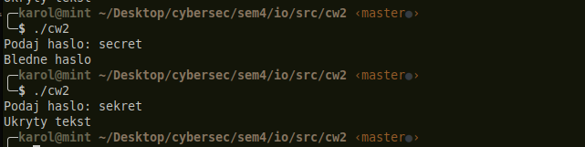
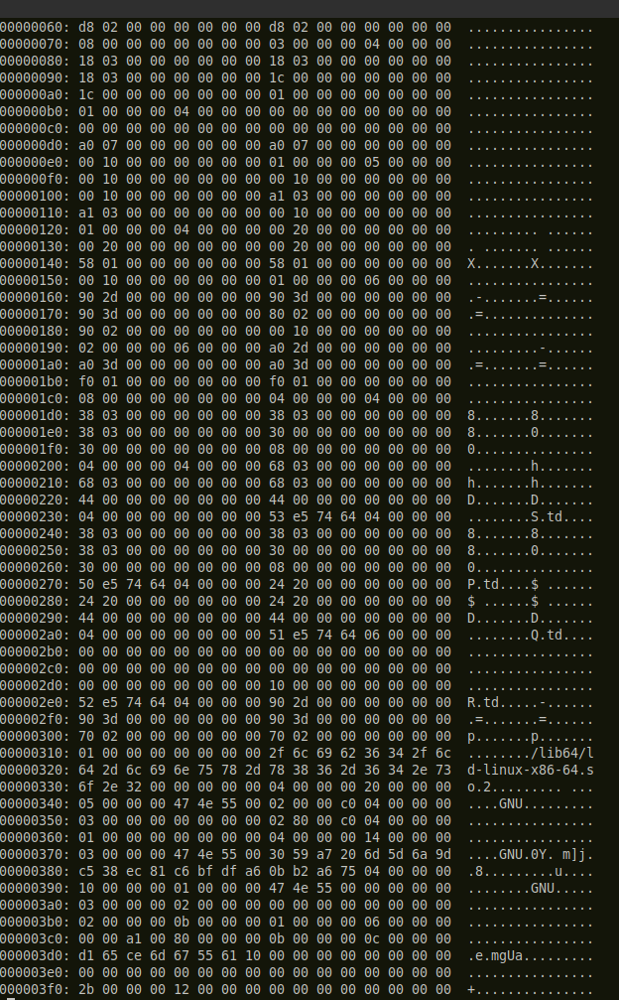
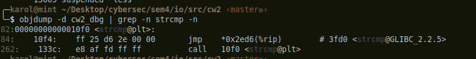
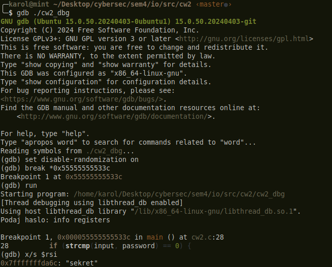

# CW2 — Ukryty napis po podaniu hasła

## Dane do sprawozdania
- Przedmiot: IO
- Ćwiczenie: CW2
- Temat: analiza programu z ukrytym hasłem i tekstem
- Grupa: _uzupełnij_
- Członkowie grupy: _uzupełnij_
- Data wykonania: _uzupełnij_

## Cel ćwiczenia
Celem ćwiczenia było przygotowanie programu w języku C/C++, który po podaniu poprawnego hasła wyświetla ukryty napis. Program został zapisany w taki sposób, aby hasło oraz tekst nie były łatwe do odczytania bezpośrednio w hex edytorze. Następnie przeprowadzono analizę binarki, odczytano sposób działania zabezpieczenia i zmodyfikowano plik wykonywalny tak, aby ukryty tekst wyświetlał się bez konieczności podawania poprawnego hasła.

Kod źródłowy programu znajduje się poniżej w treści sprawozdania, a zrzuty ekranu zostały umieszczone w folderze `resources/`.

## Wymagania z zadania
1. Napisać program w języku C lub C++, który po podaniu hasła wypisuje ukryty napis.
2. Skompilować program.
3. Zabezpieczyć hasło i tekst przed łatwym odczytem w hex edytorze.
4. Przekazać program do analizy i spróbować poznać hasło lub ukryty tekst.
5. Spróbować zmodyfikować program binarnie tak, aby zawsze wyświetlał ukryty tekst.
6. Przygotować sprawozdanie w formacie PDF.

## Plan wykonania krok po kroku
1. Przygotować prosty program źródłowy z hasłem i ukrytym tekstem.
2. Ukryć dane w programie w sposób utrudniający ich odczyt z binarki.
3. Skompilować program i uruchomić go, aby potwierdzić poprawne działanie.
4. Przeanalizować plik wykonywalny w hex edytorze lub debuggerze.
5. Spróbować odczytać hasło albo znaleźć sposób na obejście zabezpieczenia.
6. W razie potrzeby zmodyfikować binarkę i sprawdzić rezultat.
7. Opisać cały przebieg w sprawozdaniu.

## Przebieg realizacji
### 1. Program źródłowy
```c
#include <stdio.h>
#include <string.h>

static unsigned char byte_key(size_t index, unsigned char seed) {
    return (unsigned char)(seed + (unsigned char)(index * 17u));
}

static void xor_decode(unsigned char *buffer, size_t length, unsigned char seed) {
    for (size_t index = 0; index < length; ++index) {
        buffer[index] = (unsigned char)(buffer[index] ^ byte_key(index, seed));
    }
}

int main(void) {
    const unsigned char seed = 0x4D;
    unsigned char password[] = { 0x3E, 0x3B, 0x04, 0xF2, 0xF4, 0xD6, 0xB3 };
    unsigned char message[] = { 0x18, 0x35, 0x1D, 0xF9, 0xE5, 0xDB, 0x93, 0xB0, 0xB0, 0x8D, 0x84, 0x7C, 0x19 };
    char input[64];

    printf("Podaj haslo: ");
    if (fgets(input, sizeof(input), stdin) == NULL) {
        return 1;
    }

    input[strcspn(input, "\n")] = '\0';

    xor_decode(password, sizeof(password), seed);
    if (strcmp(input, password) == 0) {
        xor_decode(message, sizeof(message), seed);
        puts(message);
    } else {
        puts("Bledne haslo");
    }

    return 0;
}
```

Plik źródłowy: [cw2.c](cw2.c)

### 2. Kompilacja
Program można skompilować poleceniem:

```bash
gcc cw2.c -o cw2
```

Po uruchomieniu poprawna odpowiedź powinna spowodować wyświetlenie ukrytego tekstu, a niepoprawna odpowiedź powinna zakończyć się komunikatem o błędnym haśle.

Przykładowy wynik działania programu przedstawia [working_example.png](resources/working_example.png).



### 3. Analiza binarki
Do analizy pliku wykonywalnego można użyć hex edytora, debuggera lub deasemblatora. W tej wersji programu dane nie są zapisane jako czytelne napisy, ponieważ zostały zakodowane zależnym od indeksu XOR-em, co utrudnia ich bezpośrednie odczytanie i eliminuje prosty stały klucz widoczny w binarce.

Pierwszym krokiem było sprawdzenie zawartości binarki w widoku heksadecymalnym. Widać, że dane nie występują w postaci jawnego napisu, tylko jako zaszyfrowane bajty, co potwierdza, że prosty podgląd pliku nie wystarcza do odczytania hasła.

Podgląd zaszyfrowanych danych pokazano na [zaszyfrowany_xxd.png](resources/zaszyfrowany_xxd.png).



Następnie wykonano analizę deasemblacji programu. W okolicy wywołania `strcmp` widać porównanie wprowadzonego hasła z odszyfrowanym buforem oraz skok warunkowy decydujący o dalszym przebiegu programu.

Widok deasemblacji przedstawia [objdump_strcmp.png](resources/objdump_strcmp.png).



W trakcie debugowania sprawdzono również zawartość rejestrów i argumentów przekazywanych do `strcmp`. Dzięki temu można było podejrzeć odszyfrowany bufor przechowywany w pamięci procesu.

Wynik tej analizy pokazano na [gdb_rsi.png](resources/gdb_rsi.png).



### 4. Modyfikacja binarna
W trakcie analizy znaleziono miejsce, w którym program wykonuje skok warunkowy po porównaniu hasła. W praktyce wystarczyło nadpisać instrukcję warunkową, aby program zawsze przechodził do gałęzi wypisującej ukryty tekst.

Widziany po modyfikacji efekt przedstawia [r2_zlamane zabezpieczenia.png](resources/r2_zlamane%20zabezpieczenia.png).


Po uruchomieniu zmodyfikowanego programu otrzymano ukryty tekst bez podawania poprawnego hasła.

## Wyniki
- Oryginalny program: po podaniu poprawnego hasła wyświetla `Ukryty tekst`.
- Analiza binarki: hasło zostało odczytane z pamięci programu podczas debugowania.
- Zmodyfikowany program: wyświetla `Ukryty tekst` także bez poprawnego hasła.

## Wnioski
Ćwiczenie pokazało, że nawet przy prostym ukrywaniu danych w binarce możliwa jest ich analiza zarówno statycznie, jak i dynamicznie. Zastosowana obfuskacja utrudnia szybki odczyt napisu w hex edytorze, ale nie chroni przed debugowaniem i modyfikacją skoków warunkowych.

Najważniejszy wniosek jest taki, że zabezpieczenie oparte wyłącznie na ukrywaniu stałych w pliku wykonywalnym nie stanowi realnej ochrony. Po znalezieniu miejsca porównania hasła można było albo podejrzeć dane w pamięci, albo ominąć warunek i wymusić wykonanie właściwej gałęzi programu.

W praktyce oznacza to, że o bezpieczeństwie programu decyduje logika i kontrola dostępu, a nie samo „schowanie” tekstu w binarce.

## Załączniki
- Kod źródłowy programu
- Zrzuty ekranu z folderu `resources/`
- Ewentualne notatki z analizy binarki
